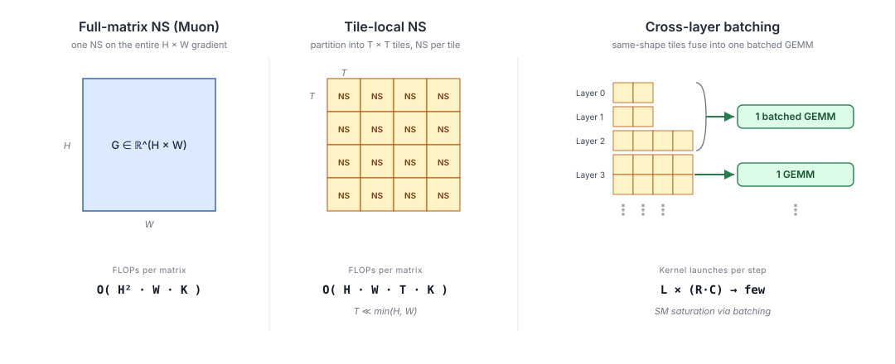
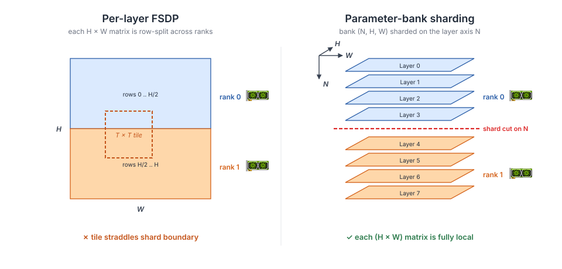

<h1 align="center">HiMuon</h1>

<p align="center">
  <strong>A tile-local Newton-Schulz orthogonalized optimizer for LLM pre-training.</strong> HiMuon applies the Newton-Schulz iteration independently to fixed-size tiles of each momentum/gradient matrix, with the tile size ranging from the full matrix (equivalent to Muon) down to small intra-matrix tiles. Full training stack (single-GPU / DDP / FSDP with parameter-bank sharding) across Llama and Qwen model families, with baseline optimizers (AdamW, Muon, SOAP) for comparison.
</p>

<p align="center">
  <a href="LICENSE"></a>
  
  
  
</p>

---

## ✨ Highlights

- **HiMuon optimizer** — tile-local Newton-Schulz orthogonalization; custom Triton kernel (SRAM-resident, FP32-accumulating), cross-layer batched GEMM, full-step CUDA graph capture.
- **Dynamic tile size** — the tile spans from the full matrix (`tile_size ≥ matrix dims`, one tile → Muon) down to small intra-matrix tiles; lower FLOPs, less HBM traffic, reconfigurable mid-training with automatic CUDA-graph recapture.
- **FSDP parameter-bank sharding** — scales HiMuon and Muon to large models with no cross-rank collectives inside the optimizer.
- **One CLI, three modes** — `train.py` / `train_ddp.py` / `train_fsdp.py` share the same flags; single-GPU ↔ DDP ↔ FSDP is a one-line change.
- **Optimizer zoo** — AdamW, SOAP, Muon, HiMuon via `--optimizer <name>` through one factory.

<p align="center">
  
</p>

---

## 📦 Installation

Requires Python 3.12 and [uv](https://docs.astral.sh/uv/):

```bash
uv sync                # core dependencies
uv sync --extra dev    # + pytest, matplotlib
uv sync --all-extras   # everything
```

Triton (bundled with PyTorch) is required for the HiMuon kernels. GPU training requires CUDA 12.x with bf16 support (supported devices: A40 / L40S / A100 / H100).

---

## 🚀 Quick Start

### Single GPU

```bash
uv run train.py \
    --model Qwen3-0.6B \
    --bs 1 \
    --grad-acc 16 \
    --optimizer adamw \
    --lr 1e-3 \
    --wd 0.1 \
    --save-checkpoint
```

### DDP (multi-GPU, single node)

```bash
CUDA_VISIBLE_DEVICES=0,1 uv run torchrun \
    --standalone --nnodes=1 --nproc_per_node=2 \
    train_ddp.py
```

### FSDP (multi-GPU, sharded)

Parameter-bank sharding is required; see [Parameter-Bank Sharding](#parameter-bank-sharding).

```bash
CUDA_VISIBLE_DEVICES=0,1,2,3 uv run torchrun \
    --standalone --nnodes=1 --nproc_per_node=4 \
    train_fsdp.py \
    --model Qwen3-4B \
    --bs 2 \
    --grad-acc 8 \
    --max-length 1024 \
    --optimizer himuon \
    --lr 1e-2
```

---

## ⚡ Advanced Features

### Reconfigure schedule

Change HiMuon's `tile_size` mid-training via `--reconfigure-schedule`, a JSON list of `{"step": N, ...}` dicts. Works in single-GPU, DDP, and FSDP alike — it's an optimizer-level feature, not tied to any distributed mode. A common pattern is a full-to-local schedule: start with `tile_size` larger than any matrix (each matrix becomes a single tile, so the tiled map coincides with the full-matrix Muon map, while retaining HiMuon's cross-layer batching) and switch to tile-local HiMuon for the main training phase:

```bash
uv run train.py \
    --model Qwen3-0.6B \
    --optimizer himuon \
    --lr 1e-2 \
    --reconfigure-schedule '[{"step":0,"tile_size":1000000000},{"step":200,"tile_size":512}]'
```

### CUDA graph capture

HiMuon captures the full optimizer step (momentum → tile → NS → scatter → untile) into a CUDA graph after a few eager warmup steps (for Triton autotuning and allocator settling), replacing hundreds of per-parameter kernel launches with one `cudaGraphLaunch`. LR and weight decay are applied outside the graph so schedulers take effect without recapture. Enabled by default — pass `--no-cuda-graph` to disable. `reconfigure()` clears the graph; it's re-captured on the next step.

### HF-format checkpoint save

Pass `--save-checkpoint` to any training script (`train.py` / `train_ddp.py` / `train_fsdp.py`) to save the trained model in standard Hugging Face format, round-trippable with `AutoModelForCausalLM.from_pretrained`. Under FSDP with parameter-bank sharding, an internal un-bank step re-keys the gathered state dict to per-layer HF param names (`model.layers.{i}.self_attn.q_proj.weight`, …) so the output remains HF-compatible.

---

## 🔧 Optimizers

| CLI key | Class | Distributed modes | Notes |
|---|---|---|---|
| `adamw` | `AdamW` | single / DDP / FSDP | standard AdamW |
| `soap` | `SOAP` | single / DDP | Shampoo preconditioner, Adam in its eigenbasis |
| `muon` | `Muon` | single / DDP | Newton-Schulz orthogonalization |
| `muon-fsdp` | `MuonFsdp` | FSDP + banks | Muon ported to bank DTensors; baseline for comparison with HiMuon |
| `himuon` | `HiMuon` | single / DDP / FSDP + banks | tile-local NS, cross-layer batched, CUDA graph |
| `himuon-legacy` | `HiMuonLegacy` | single / DDP | earlier reference implementation |

The factory in `src/himuon/optim.py` groups parameters into decay / no-decay buckets and further splits Muon-eligible parameters (2D, excluding embeddings and `lm_head`) from their AdamW fallback.

---

<a id="parameter-bank-sharding"></a>
## 🧩 Parameter-Bank Sharding

Standard `fully_shard` row-splits each matrix across ranks, which breaks tile-local optimizers: a tile would straddle shard boundaries. `src/himuon/fsdp_bank/` solves this by grouping same-shape per-layer projections (e.g., all `q_proj.weight` across layers) into a single 3D tensor of shape `(num_layers, H, W)` and sharding on the layer axis. Each rank then holds complete `(H, W)` matrices — just different layer indices — so per-matrix NS needs no cross-rank collectives.

<p align="center">
  
</p>

Minimal usage:

```python
from himuon.fsdp_bank import Qwen3BankScheme, wrap_with_banks, release_pre_shard_refs
from torch.distributed.fsdp import fully_shard

model, banks = wrap_with_banks(model, Qwen3BankScheme(), world_size=ws)
fully_shard(model, mesh=mesh, mp_policy=mp_policy)
release_pre_shard_refs(banks)  # free pre-shard full-size references
```

`Qwen3BankScheme` and `Llama3BankScheme` are provided, each producing 5 banks: `q_bank`, `kv_bank`, `o_bank`, `gate_up_bank`, `down_bank`. Other model families need their own `BankScheme` implementation.

---

## 📁 Project Structure

```
himuon/
├── src/himuon/
│   ├── fsdp_bank/          # parameter-bank sharding for FSDP (Qwen3 + Llama3 schemes)
│   ├── optimizers/         # AdamW, Muon, SOAP, HiMuon
│   ├── triton_kernels/     # fused NS kernels
│   ├── dataset.py          # FineWeb streaming dataset
│   ├── logger.py           # Loguru + W&B logging
│   ├── model.py            # model loading (Llama, Qwen)
│   ├── optim.py            # optimizer factory + parameter grouping
│   └── utils.py            # kv args parsing, time budget hook
├── train.py        # single-GPU training
├── train_ddp.py    # DDP training
└── train_fsdp.py   # FSDP training (bank-sharded)
```

---

## 🧪 Tests

```bash
uv run pytest tests/
```

`tests/unit/` (contract / API-doc checks) runs on CPU; `tests/integration/` requires a CUDA GPU (Triton kernels and DTensor/FSDP checks) and is auto-skipped without one.

---

## 📖 Citation

```bibtex
@article{tang2026himuon,
  title   = {Hierarchical Muon: Tiled Newton-Schulz Updates for Efficient Muon Optimization},
  author  = {Tang, Ziyuan and Xu, Tianshi and Saad, Yousef and Xi, Yuanzhe},
  journal = {arXiv preprint arXiv:2606.27216},
  year    = {2026}
}
```

---

## 🙏 Acknowledgements

- [modded-nanogpt](https://github.com/KellerJordan/modded-nanogpt) — HiMuon LR scaling and NS implementation reference
- [Muon](https://github.com/KellerJordan/Muon) — Newton-Schulz orthogonalization optimizer

---

## 📄 License

MIT — see [LICENSE](LICENSE).
